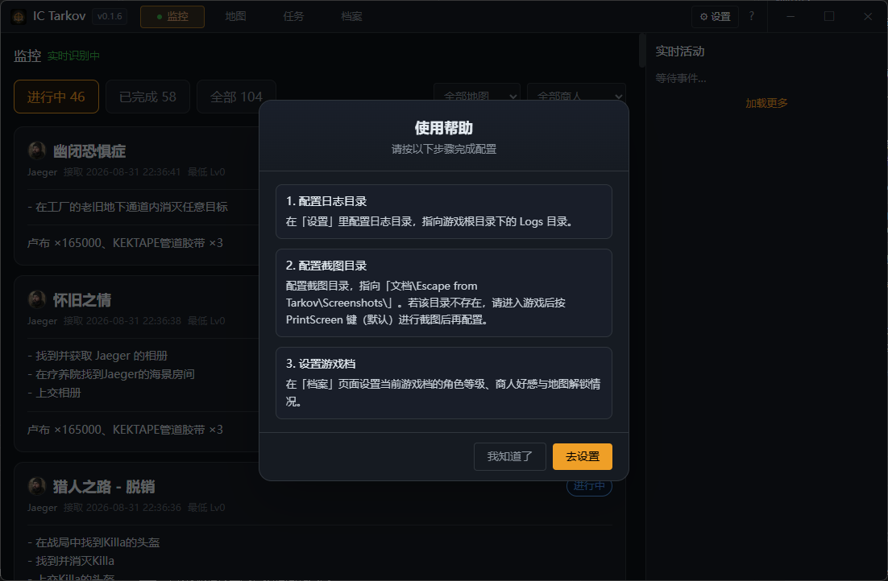
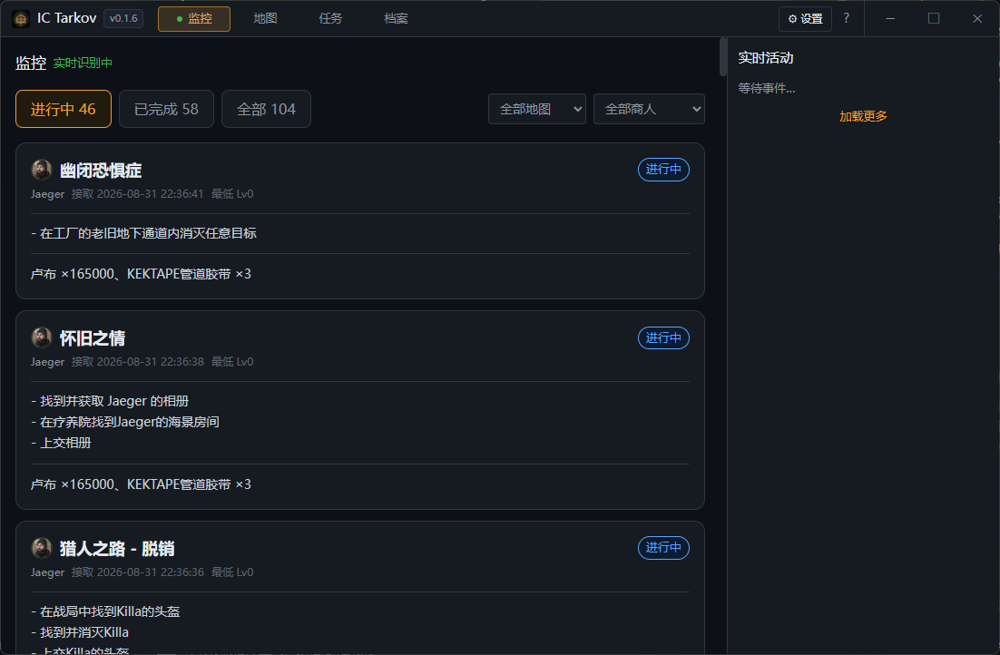
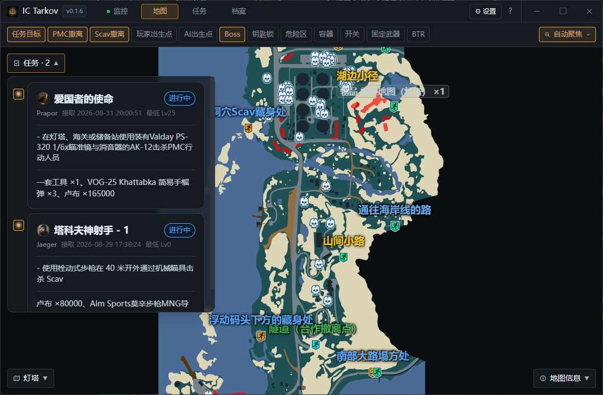
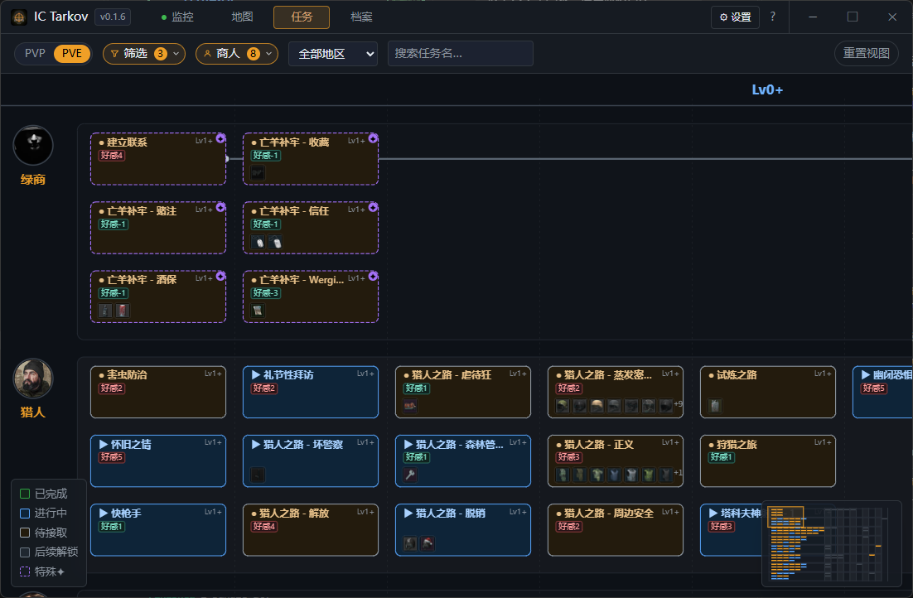

# IC Tarkov

基于 **Tauri 2 + React + TypeScript + Leaflet** 构建的《逃离塔科夫》(Escape from Tarkov) 地图 / 任务辅助桌面应用。以官方交互式地图为底图，将玩家坐标改为本地来源进行实时渲染。

> 地图骨架与标记参考 [tarkov-dev](https://github.com/the-hideout/tarkov-dev)（MIT 协议）。

## 关于

本项目的设计与数据解析参考社区成果，以下信息同步自软件内「设置 → 关于」：

- **数据来源**：游戏数据（任务、地图、物品、商人、本地化等）均来自 [tarkov.dev](https://tarkov.dev) 提供的开放接口；中文 Wiki 使用 [eftarkov.com](https://www.eftarkov.com/)，特此致谢。
- **项目参考**：本项目的设计与数据解析参考了 [tarkov.dev](https://tarkov.dev) 的社区成果，向其贡献者致谢。
- **开发者**：icecat · 主页 [icecat.cc](https://icecat.cc)
- **开源仓库**：[github.com/IceCatcc/IC-Tarkov](https://github.com/IceCatcc/IC-Tarkov)

> **Vibe Coding 声明**：本项目在开发过程中深度使用 AI 编程（Vibe Coding）辅助生成与迭代，特此说明。代码可能未经充分人工审查，使用风险自负。

## 应用截图






## 技术栈

- **前端**：React 18 + TypeScript + Vite + Tailwind CSS
- **桌面壳**：Tauri 2（Rust）
- **地图**：Leaflet + 自定义 Leaflet 控件
- **状态管理**：Zustand
- **数据**：本地 `maps-skeleton.json` + `resources/api`，可离线运行

## 目录结构

```
eft-spy/
├── src-react/            # 前端 React 源码
├── src-tauri/            # Tauri (Rust) 桌面壳
├── public/               # 静态资源（地图底图、标记图标）
├── assets/               # 应用资源
├── tarkov_map_reference.md  # 地图嵌入参考清单
├── build.bat             # 发布构建（release + 带版本号 exe）
└── start-dev.bat         # 仅配置 MSVC 环境后保持命令行，手动 npm run tauri:dev
```

## 环境要求

- **Node.js**（建议 18+）与 npm
- **Rust** 工具链（cargo，需在 PATH 中）
- **Visual Studio 2019/2022 Build Tools**（MSVC 链接器，`vcvars64.bat`）
- **Tauri 2 前置依赖**：WebView2 运行时等，详见 [Tauri 官方文档](https://v2.tauri.app/start/prerequisites/)

## 快速开始

### 开发模式

```powershell
# 方式一：使用环境批处理脚本（自动配置 MSVC 环境后保持命令行）
.\start-dev.bat
# 在打开的命令行中运行：
npm run tauri:dev

# 方式二：手动运行（需自行确保 MSVC 环境已配置）
npm install
npm run react:dev    # 仅前端开发服务器
npm run tauri:dev    # 以 Tauri 壳启动开发模式
```

前端开发服务器地址：`http://localhost:1420`

### 构建发布包

```powershell
# 发布构建（恒为 release，拒绝 --debug），产物为带版本号的 exe / nsis / msi
.\build.bat
```

构建产物位置（Rust 使用 Tauri 默认目录，前端输出到 `src-react/dist`；打包目标仅 NSIS）：

- 应用可执行文件：`src-tauri/target/release/IC Tarkov.exe`
- 带版本号文件：`src-tauri/target/release/IC-Tarkov-<version>.exe`
- NSIS 安装包：`src-tauri/target/release/bundle/nsis/`
- 前端构建产物：`src-react/dist/`

### 仅构建 Rust 后端

```powershell
npm run tauri:build
```

## 脚本说明

| 脚本 | 说明 |
|------|------|
| `npm run tauri dev` | 以 Tauri 壳启动开发模式（透传参数） |
| `npm run tauri build` | 构建 Tauri 桌面应用（透传参数） |
| `npm run react:dev` | 启动 Vite 前端开发服务器 |
| `npm run react:build` | 类型检查 + 前端生产构建（输出到 `src-react/dist/`） |
| `npm run react:preview` | 预览生产构建 |

## 配置

应用配置位于 `src-tauri/tauri.conf.json`：

- `productName` / `version` / `identifier`：应用元信息
- `bundle.resources`：打包时携带的本地资源（`resources/api`、`maps-skeleton.json`）
- 窗口默认尺寸 1100×720，最小 880×560，深色主题，无边框

## 持续集成（GitHub Actions）

项目配置了 `.github/workflows/release.yml`，在 Windows runner 上构建并自动发布 Release：

- **触发方式**：推送 `v*` 格式的 tag（如 `git tag v0.1.6`），或在 Actions 面板手动触发
- **构建内容**：仅 NSIS 安装包（见 `tauri.conf.json` 的 `bundle.targets`）
- **发布结果**：自动创建 GitHub Release，并上传 `src-tauri/target/release/bundle/nsis/` 下的安装程序；同时留存 workflow artifacts
- **版本说明**：取自仓库根目录的 `RELEASE_NOTES.md`，发布前在本地维护好该文件即可

发布流程：

```powershell
# 1. 更新 RELEASE_NOTES.md，写下本次版本的更新内容

# 2. 确认版本号与 tauri.conf.json 的 version 一致（当前 0.1.6）

# 3. 提交后打 tag 并推送
git add RELEASE_NOTES.md
git commit -m "docs: 更新发布说明"
git tag v0.1.6
git push origin main
git push origin v0.1.6
```

> 若 `RELEASE_NOTES.md` 不存在或为空，Release 仍会正常创建，只是说明部分为空。

> 注意：Windows runner 按 2 倍分钟数计费，且 release 构建开启了 LTO，单次耗时较长，建议仅在打 tag 时触发。

## 许可

地图骨架与标记数据参考 [tarkov-dev](https://github.com/the-hideout/tarkov-dev)，遵循 MIT 协议（可自由修改/再发布，保留版权声明即可）。
