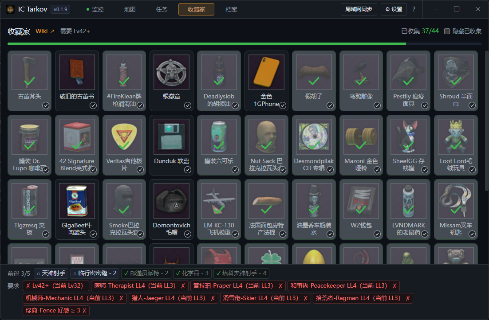

# IC Tarkov

基于 **Tauri 2 + React + TypeScript + Leaflet** 构建的《逃离塔科夫》(Escape from Tarkov) 地图 / 任务辅助桌面应用。以官方交互式地图为底图，将玩家坐标改为本地来源进行实时渲染。

> 地图骨架与标记参考 [tarkov-dev](https://github.com/the-hideout/tarkov-dev)（MIT 协议）。

## 功能特性

- **实时定位**：解析游戏截图的玩家坐标，在塔科夫交互式地图上实时渲染当前位置
- **任务监控**：实时监控游戏日志，同步追踪游戏内的任务状态，任务列表与活动动态联动展示
- **任务关系图**：可视化展示任务依赖与商人解锁关系，支持查看任务详情与中文 Wiki
- **游戏档案**：维护角色等级、商人好感与地图解锁状态，地图标记与任务可用性随之联动
- **自动更新提示**：启动时检测 GitHub Releases，有新版本时提示；点击可查看更新说明并前往下载
- **收藏家物品管理**：支持收藏家物品的追踪管理，手动勾选已有的物品。
- **移动端（Android）**：提供 Android 版本，手机也能随时查看任务、地图与游戏档案，与桌面端共享同一套数据与交互。
- **局域网同步 / 数据迁移**：手机与电脑通过局域网「同步」功能双向同步任务、收藏与档案；支持将任务状态 / 收藏 / 设置打包为 zip 导入导出，便于备份与跨端迁移。
- **日志重新扫描**：重新扫描日志支持「覆盖」与「补充」两种模式，灵活应对不同存档情况。

## 移动端（Android）

除 Windows 桌面端外，本项目也构建 Android 应用，可在手机上使用核心的任务、地图与档案功能，并通过局域网与电脑端同步数据。

构建 APK（需自行配置 `JAVA_HOME` / `ANDROID_HOME` / `NDK_HOME`，见仓库内 `android-build.bat` / `android-release.bat`）：

```powershell
npm run tauri:android          # 构建并自动签名 aarch64 APK
npm run tauri:android:dev      # 真机 / 模拟器开发调试
```

CI（`.github/workflows/release.yml`）也提供 Android APK 构建发布 job，推送 `v<version>` tag 后会一并产出桌面安装包与 Android APK。

## 关于

本项目的设计与数据解析参考社区成果，以下信息同步自软件内「帮助 → 关于」（顶栏 `?` 打开帮助窗口，右下角「关于」按钮）：

- **数据来源**：游戏数据（任务、地图、物品、商人、本地化等）均来自 [tarkov.dev](https://tarkov.dev) 提供的开放接口；中文 Wiki 使用 [eftarkov.com](https://www.eftarkov.com/)，特此致谢。
- **项目参考**：本项目的设计与数据解析参考了 [tarkov.dev](https://tarkov.dev) 的社区成果，向其贡献者致谢。
- **开发者**：icecat · 主页 [icecat.cc](https://icecat.cc)
- **开源仓库**：[github.com/IceCatcc/IC-Tarkov](https://github.com/IceCatcc/IC-Tarkov)

> **Vibe Coding 声明**：本项目在开发过程中深度使用 AI 编程（Vibe Coding）辅助生成与迭代，特此说明。代码可能未经充分人工审查，使用风险自负。

## 应用截图




## 技术栈

- **前端**：React 18 + TypeScript + Vite + Tailwind CSS
- **桌面壳**：Tauri 2（Rust）
- **地图**：Leaflet + 自定义 Leaflet 控件
- **状态管理**：Zustand
- **数据**：本地 `maps-skeleton.json` + `resources/api`，可离线运行

## 目录结构

```
IC-Tarkov/
├── src-react/                 # 前端 React 源码（页面 / 组件 / 状态）
├── src-tauri/                 # Tauri (Rust) 桌面壳
│   └── resources/             # 打包携带的游戏数据（api / maps-skeleton.json）
├── public/                    # Vite 静态资源（地图底图、标记图标）
├── assets/                    # 应用资源（图标等）
├── imgs/                      # README 应用截图
├── scripts/                   # 数据抓取脚本（fetch_api_data.py）
├── tarkov_map_reference.md    # 地图嵌入参考清单
├── RELEASE_NOTES.md           # 发布说明（GitHub Release 正文）
├── AGENTS.md                  # AI 协作约定（Vibe Coding）
├── build.bat                  # 发布构建（恒 release + 带版本号 exe）
├── start-dev.bat              # 配置 MSVC 环境后保持命令行，手动 npm run tauri:dev
├── check-tauri.bat            # 快速 cargo check（校验 Rust 侧可编译）
├── package.json               # npm 脚本与依赖
└── vite.config.ts / tailwind.config.js / tsconfig*.json / postcss.config.js  # 前端工程配置
```

## 环境要求

- **Node.js**（建议 18+）与 npm
- **Rust** 工具链（cargo，需在 PATH 中）
- **Visual Studio 2019/2022 Build Tools**（MSVC 链接器，`vcvars64.bat`）
- **Tauri 2 前置依赖**：WebView2 运行时等，详见 [Tauri 官方文档](https://v2.tauri.app/start/prerequisites/)

## 快速开始

### 开发模式

```powershell
# 方式一：使用环境批处理脚本（自动配置 MSVC 环境后保持命令行）
.\start-dev.bat
# 在打开的命令行中运行：
npm run tauri:dev

# 方式二：手动运行（需自行确保 MSVC 环境已配置）
npm install
npm run react:dev    # 仅前端开发服务器
npm run tauri:dev    # 以 Tauri 壳启动开发模式
```

前端开发服务器地址：`http://localhost:1420`

### 构建发布包

```powershell
# 发布构建（恒为 release，拒绝 --debug）：生成 app exe + 带版本号 exe + NSIS 安装包
.\build.bat
```

构建产物位置（Rust 使用 Tauri 默认目录，前端输出到 `src-react/dist`；打包目标仅 NSIS）：

- 应用可执行文件：`src-tauri/target/release/IC Tarkov.exe`
- 带版本号文件：`src-tauri/target/release/IC-Tarkov-<version>.exe`
- NSIS 安装包：`src-tauri/target/release/bundle/nsis/`
- 前端构建产物：`src-react/dist/`

### 仅构建 Rust 后端

```powershell
npm run tauri:build
```

## 脚本说明

| 脚本 | 说明 |
|------|------|
| `npm run tauri dev` | 以 Tauri 壳启动开发模式（透传参数） |
| `npm run tauri build` | 构建 Tauri 桌面应用（透传参数） |
| `npm run react:dev` | 启动 Vite 前端开发服务器 |
| `npm run react:build` | 类型检查 + 前端生产构建（输出到 `src-react/dist/`） |
| `npm run react:preview` | 预览生产构建 |

## 配置

应用配置位于 `src-tauri/tauri.conf.json`：

- `productName` / `identifier`：应用元信息
- 版本号统一在 `src-tauri/Cargo.toml` 中维护（发布细节见 AGENTS.md）
- `bundle.resources`：打包时携带的本地资源（`resources/api`、`maps-skeleton.json`）
- 窗口默认尺寸 1100×720，最小 880×560，深色主题，无边框

## 持续集成（GitHub Actions）

仓库配置了 `.github/workflows/release.yml`：推送 `v<version>` 格式的 tag 后，会在 Windows runner 上构建 NSIS 安装包并自动创建 GitHub Release；说明正文取自 `RELEASE_NOTES.md`，也可在 Actions 面板手动触发。具体发布流程见 AGENTS.md。

## 许可

地图骨架与标记数据参考 [tarkov-dev](https://github.com/the-hideout/tarkov-dev)，遵循 MIT 协议（可自由修改/再发布，保留版权声明即可）。
